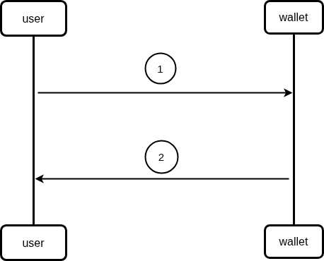

# get wallet info



## Description

1. user put phone number in request url and  call `WalletInfo` endpoint from the wallet component
2. wallet component checks if account exist and return response (user balance)

## wallet

```
Name:   getWalletInfo
method: Get
Url:    http://localhost:9898/wallet/:number
Header: no content
Body:   no content
Errors:
    - code: 400
      Name: bad request
      Body:
         {
            "error" : "invalid number",
         }
    - code: 404
      Name: not found
      Body:
         {
            "error" : "number not found",
         }
    - code: 500
      Name: internal server error
      Body:
         {
            "error" : "internal error, please try again later ",
         }
Responses:
      - code: 200
        Name: accepted
        Body:
            {
                "Balance" :          (int64),
            }

```
