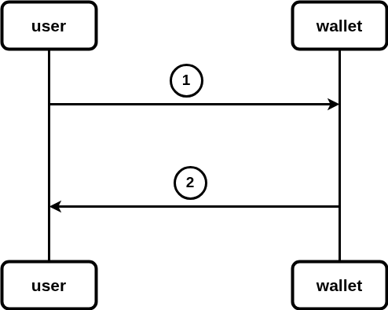

# Create wallet account



## Description

1. user put phone number as wallet ID in request url and calls `CreateAccount` endpoint from the wallet component
2. wallet component checks if the ID is avalible to use and return request response(success/failure with created At)

## create wallet

```
Name: CreateAccount
method: Get
Url: http://localhost:9898/wallet/Create-Account/:number
Header:
Body:
Errors:
    - code: 400
      Name: bad request
      Body:
         {
            "error" : "invalid request url, Make sure you've entered allowed charecters",
         }
    - code: 500 
      Name: Internal server error
      Body:
          {
            "error" : "internal error, Plese try again later",
          }
    - code: 403
      Name: forbidden
      Body:
          {
            "error" : "this WalletID is used by another account",
          }
Responses:
    - code: 201
      Name: created
      Body: 
          {
            "message" : "account has been created successfully",
            "date created" : (Time.time)
          }
```