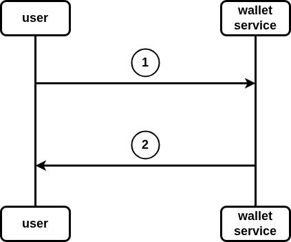

# wallet transactions



## Description

1. user calls `transactions` endpont from the wallet component and give it specific phoneNumber.
2. wallet component returns request's response.(wallet transactions)

# Api contract

## wallet transactions

```
Name: transactions
Method: Post
Url: http://localhost:9898/wallet/transactions/:number
Headers:
Body:
Errors:
    - code: 404
      Name: not found
      Body:
          {
            "error" : "wallet does not exist"
          }
    - code: 500
      Name: internal server error
      Body:
Responses:
    - code: 200
      Name: ok
      Body:
          {
            "transaction-ID" :    (int),
            "value" : (unit64),
            "date" :  (Time.time)
          }
```
